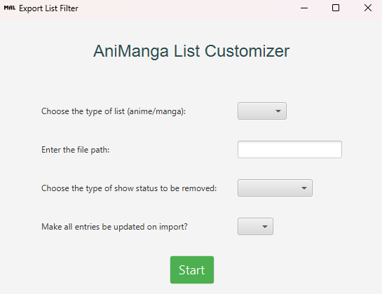

# MAL .xml-Export  Configuration Tool

An application designed to manipulate and configure XML files exported from MyAnimeList.
With this tool, users can filter entries by show status — such as "Watching", "Completed", etc.
— and toggle if they want all entries to be suitable for importing back into the system.

## XML File Modification

The tool modifies the XML file based on the specified options.

- **Removing entries**: The tool iterates through the XML file and removes the entries
that match the specified status type. The resulting file will no longer contain those entries.
- **Updating importability status**: If the option to make all entries importable is enabled, then all entries will be
updated on import and will potentially overwrite existing entries).

## Prerequisites

- Ensure you have Java Runtime Environment (JRE) installed on your system.

## Contributions

Contributions to this project are welcome! If you have any suggestions, bug reports, or feature requests,
please open an issue or submit a pull request.

## License

This project is licensed under the [GNU General Public License](LICENSE).
Feel free to use, modify, and distribute the code for personal and commercial purposes.
