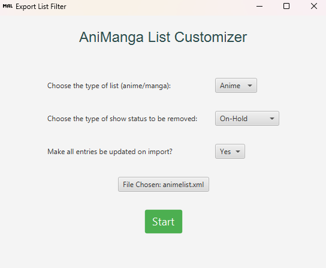

# MAL .xml-Export  Configuration Tool

This Java application allows you to configure an XML file exported from MyAnimeList. You can remove entries based on show status (e.g., Watching, Completed, On-Hold, Dropped, Plan to Watch) and update the importability status of the entries. The tool utilizes the ~~Java Swing~~ JavaFX library to provide a graphical user interface (GUI) for easy interaction.



## Prerequisites

- Java Development Kit (JDK) installed on your system.

## How to Use

1. Clone or download the source code files to your local machine.
2. Open the command prompt or terminal and navigate to the project directory.
3. Compile the Java source code by executing the following command:

```shell
javac Main.java
```

4. Run the application using the following command:

```shell
java Main
```

5. Choose your specified modifications & enter the file path to the XML file in the GUI window.
6. After providing the required inputs, click the **Start** button to initiate the configuration process.
7. The application will perform the requested operations on the XML file.
8. You can repeat the process by entering new values or close the application.

## XML File Modification

The tool modifies the XML file based on the specified options.

- **Removing entries**: The tool iterates through the XML file and removes the entries that match the specified status type. The resulting file will no longer contain those entries.
- **Updating importability status**: If the option to make all entries importable is enabled, then all entries will be updated on import and will potentially overwrite existing entries).

**Note**: This program overwrites the original XML file!

## Dependencies

The application uses the following Java libraries:

- `javax.xml.parsers` package for parsing and manipulating XML files.
- `javax.xml.transform` package for transforming the modified XML and saving it back to the file system.
- `org.w3c.dom` package for working with the XML Document Object Model.

## Contributions

Contributions to this project are welcome! If you have any suggestions, bug reports, or feature requests, please open an issue or submit a pull request.

## License

This project is licensed under the [GNU General Public License](LICENSE). Feel free to use, modify, and distribute the code for personal and commercial purposes.
